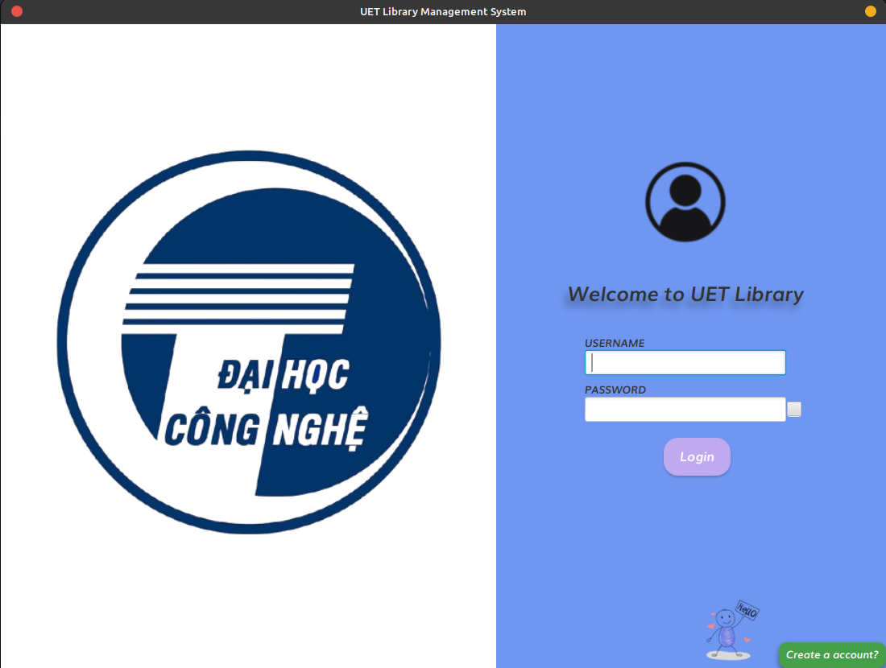

# UET Library Management
This project is a Library Management System developed using Java and JavaFX. The application utilizes MySQL for database management and integrates the Google Books API to handle various book-related tasks, such as searching and retrieving book information.

## Features
### User Features:
- **Account Creation**: Users can register a new account to access the system.
- **Book Search**: Users can easily search for books using various filters such as title, author, or genre.
- **Book Return**: After borrowing, users can return books directly through the application.
- **Chat Functionality**: Real-time one-on-one chat feature, allowing users to communicate seamlessly.
- **Edit Personal Information**: Users can update their personal details such as name, contact information, and preferences.

### Admin Features:
- **Book Management**: Admins can add, edit, and delete books from the library catalog.
- **Overdue Book Tracking**: Admins can monitor and manage overdue books, ensuring proper follow-up actions.
- **Notifications**: Admins have the ability to send notifications to users regarding system updates, overdue books, or other important information.

## Preview
### Below is the class diagram of this project:

### Below is a visual representation of the circular image in the application:

## How to Use
Updating...

### Contributions
This project is actively developed and maintained by the following contributors:
- [Nguyen Van Phuc 23021664]
- [Kieu Thien Quy 23021676]

We are continuously improving the application with new features and updates to ensure a robust and user-friendly library management system.
Thanks a lot!